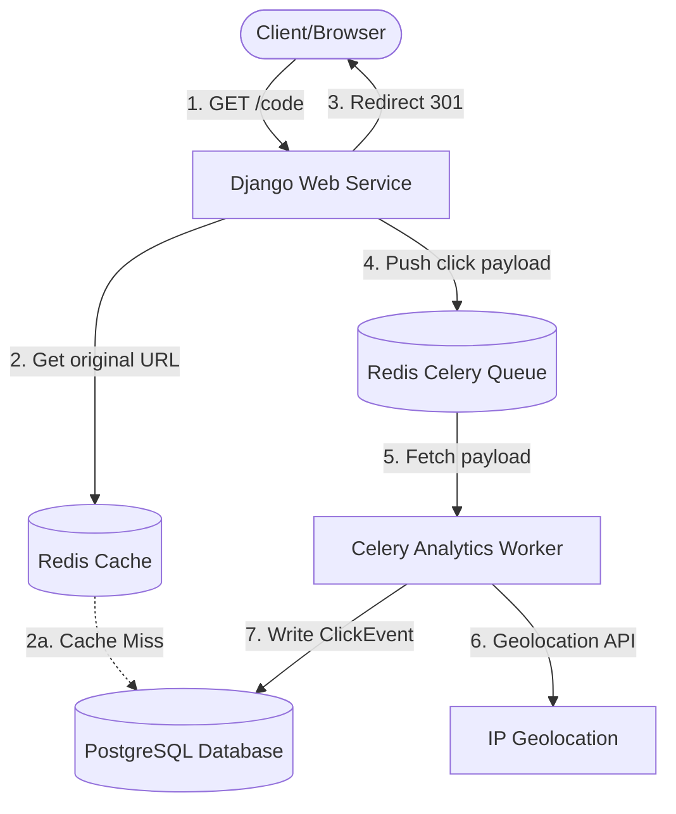

# LinkForge Architecture

LinkForge is designed for high read traffic and instant redirections, isolating heavy database writes and analytic compilations from the user response thread.

## Component Overview



## Redirection Flow (HTTP 301)
1. **Request Reception**: Django receives the request matching the pattern `/<short_code>`.
2. **Cache Resolution**: The application queries the Redis cache (`short_url:<short_code>`).
   * **Cache Hit**: Resolves the original URL and DB primary key in $O(1)$ time.
   * **Cache Miss**: Queries the PostgreSQL table (`ShortURL`). If found, stores the mapping in Redis with a 24-hour TTL. If not found, returns `HTTP 404`.
3. **Async Offloading**: The client's IP, User-Agent, Referer, and redirect timestamp are packaged and queued as a Celery task (`record_click_task.delay`).
4. **Immediate Redirection**: The server immediately returns an `HTTP 301` Permanent Redirect. The client does not wait for database inserts, geolocations, or User-Agent parsing.

## Analytics Worker Flow
1. **Queue Retrieval**: The Celery worker fetches the click event payload from Redis.
2. **User-Agent Analysis**: Parses browser family, OS family, and respective versions.
3. **IP Geolocation**: Checks if the IP is private/local. If public, invokes a lightweight Geolocation API with a timeout to retrieve the country of origin.
4. **Database Insertion**: Saves a `ClickEvent` log to PostgreSQL.
5. **Atomic Counter Update**: Updates the `click_count` on the respective `ShortURL` model atomically using an `F()` expression:
   ```sql
   UPDATE urls_app_shorturl 
   SET click_count = click_count + 1 
   WHERE id = <short_url_id>;
   ```

## Structured Logging
A uniform python logger (`linkforge`) logs:
* Successful short URL creations.
* Redirect hits and misses.
* Database fallbacks and cache connection errors.
* Worker errors (e.g. failed geolocation calls).
